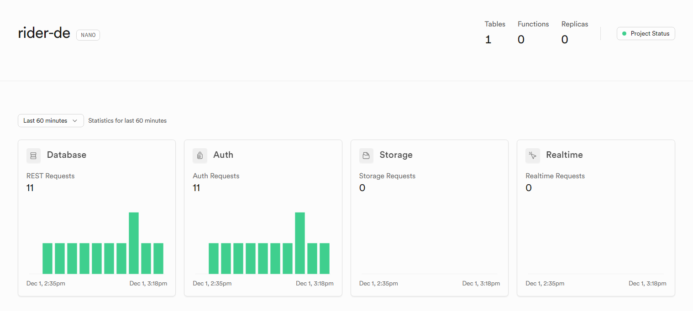
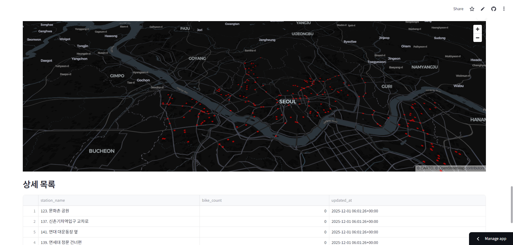

# I AM DATA ENGINEERING RIDER

> **로컬을 넘어 클라우드로. 비용 0원으로 구축하는 실시간 데이터 파이프라인.**
>
> OCI(Oracle Cloud Infrastructure) **Always Free Tier** 환경의 제약(1GB RAM)을 극복하고, **Terraform**과 **Modern Data Stack(DuckDB, Supabase)** 을 활용해 구축한 경량 따릉이 관제 플랫폼입니다.

<p align="center">
  
</p>

## 🏗️ Project Architecture

무거운 Spark와 Kafka 대신, 단일 노드에서 고성능을 내는 DuckDB와 관리형 SaaS를 조합했습니다. 인프라 비용은 **0원**입니다.

| 영역 | 기술 스택 | 설명 |
| :--- | :--- | :--- |
| **Infra** |   | OCI AMD Free Tier(1GB RAM) 서버 자동 구축 (IaC) |
| **DevOps** |  | CI/CD 파이프라인: 코드 검사부터 자동 배포까지 |
| **Orchestration** |  | `schedule` 라이브러리 기반 경량 스케줄러 |
| **Processing** |  | 인메모리 SQL 엔진으로 데이터 필터링 및 변환 처리 |
| **Storage** |  | Cloud PostgreSQL (SaaS) |
| **Visualization** |  | 실시간 대여소 현황 지도 시각화 |

## 🚀 Key Features & Engineering Decisions

### 1. Cloud Infrastructure & IaC
- **문제:** 클라우드 리소스를 매번 수동으로 생성하고 관리하기 번거로움
- **해결:** **Terraform**으로 VCN, 보안 그룹, Compute Instance 등 모든 인프라를 코드화. 명령어 한 줄로 인프라 생성/삭제 가능

### 2. Resource Optimization (Spark → DuckDB)
- **문제:** OCI Free Tier는 RAM이 1GB밖에 안 돼서 JVM 기반 Spark, Kafka 구동 불가
- **해결:** 단일 노드 처리에 특화된 OLAP 엔진 **DuckDB** 도입. Pandas보다 메모리 효율적이고 SQL 기반 빠른 집계 처리

### 3. CI/CD Pipeline
- **문제:** 코드 수정할 때마다 서버 접속해서 `git pull` 치는 게 비효율적
- **해결:** **GitHub Actions** 구축
    - **CI:** Python Lint와 Docker 빌드 테스트 자동화
    - **CD:** `main` 브랜치 머지 시 OCI 서버에 자동 배포 및 컨테이너 재시작

## 📂 Directory Structure

```
.
├── .github/workflows/      # CI/CD 파이프라인
│   ├── ci.yml              # PR 시 코드 검증
│   └── cd.yml              # Main 머지 시 자동 배포
├── scripts/                # 데이터 파이프라인
│   ├── etl_job.py          # Extract -> Transform -> Load
│   └── run_scheduler.py    # 10분 주기 스케줄러
├── streamlit/              # 시각화 대시보드
│   ├── app.py              # 지도 및 차트
│   └── requirements.txt    # 배포용 의존성
├── terraform/              # 인프라 코드 (IaC)
│   ├── main.tf             # OCI 리소스 정의
│   └── variables.tf        # 변수
├── docker-compose.yml      # Worker 컨테이너
└── Dockerfile              # Python Worker 이미지
```

## 🛠️ How It Works

**Infrastructure Setup**
- Terraform으로 OCI 리전에 격리된 VCN과 컴퓨트 인스턴스 생성
- SSH 포트와 필요한 포트만 개방하여 보안 강화
- `terraform apply` 명령으로 인프라 구성 완료

**CI/CD Pipeline**
- GitHub에 코드 푸시 시 GitHub Actions 자동 실행
- Flake8으로 코드 품질 검사 및 Docker 빌드 테스트 수행
- `main` 브랜치 머지 시 SSH로 OCI 서버 접속하여 최신 코드 Pull 및 컨테이너 재시작
- 수동 배포 작업 불필요

**ETL Process**
- Docker 컨테이너 내부에서 Python 스케줄러가 10분 주기로 실행
- **Extract:** 서울 열린데이터광장 API 호출하여 실시간 따릉이 현황 수집
- **Transform:** DuckDB로 자전거 3대 미만 '부족 대여소' 필터링 처리
- **Load:** Supabase PostgreSQL `bike_status` 테이블에 Upsert
- 1GB RAM 환경에서 Pandas 대신 DuckDB 사용으로 메모리 효율 확보

**Visualization**
- Streamlit Cloud에서 GitHub 저장소 연동하여 자동 호스팅
- Supabase DB 직접 연결로 최신 데이터 조회
- `pydeck` 라이브러리로 지도 위 부족 대여소 시각화

### 📊 Real-time Data Pipeline in Action

**Supabase Database Activity**
<p align="center">
  
  <br>
  <em>10분 주기로 실행되는 ETL 파이프라인의 Database REST API 요청 로그</em>
</p>

**Streamlit Dashboard**
<p align="center">
  
  <br>
  <em>실시간 따릉이 부족 대여소 현황 지도</em>
</p>

## 🏃‍♂️ How to Run

### Prerequisites

- OCI (Oracle Cloud) 계정 및 API Key
- Supabase 프로젝트 (PostgreSQL)
- Seoul Data API Key

### 1. Infrastructure Setup

```bash
cd terraform
# terraform.tfvars 파일 생성 및 OCI 정보 입력
terraform init
terraform apply
```

### 2. Environment Configuration

서버 접속 후 `.env` 파일 생성

```ini
SEOUL_API_KEY=your_key
SUPABASE_DB_URL=your_supabase_url
```

### 3. Deployment

`main` 브랜치에 푸시하면 GitHub Actions가 자동 배포. 수동 실행도 가능:

```bash
docker-compose up -d --build
```